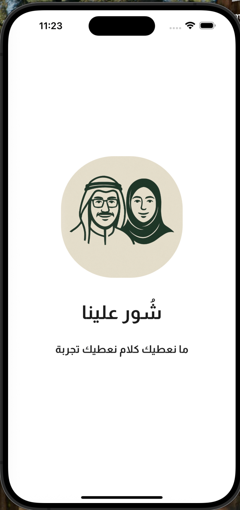

# شور علينا

تطبيق يربط الشركات الناشئة مع المتقاعدين/الخبراء لتقديم استشارات مبسّطة وفعّالة.

---

## 🛠️ التقنيات
- Flutter (Dart)
- Firebase Authentication
- Cloud Firestore
- SharedPreferences

---

## 🚀 تشغيل المشروع
1. تأكد من تثبيت Flutter 3.x و Dart.
2. اربط مشروعك مع Firebase وضع ملفات الإعداد (لا ترفعها للمستودع):
   - `android/app/google-services.json`
   - `ios/Runner/GoogleService-Info.plist`
3. نفّذ الأوامر:

```bash
flutter pub get
flutter run


